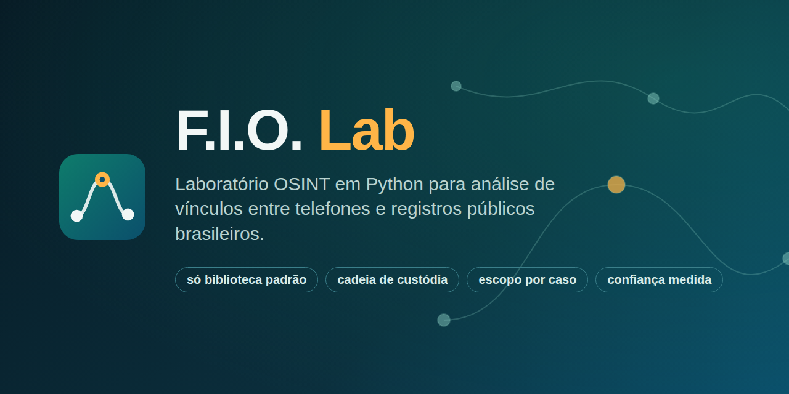
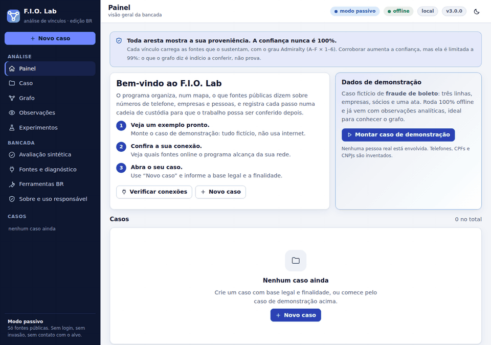
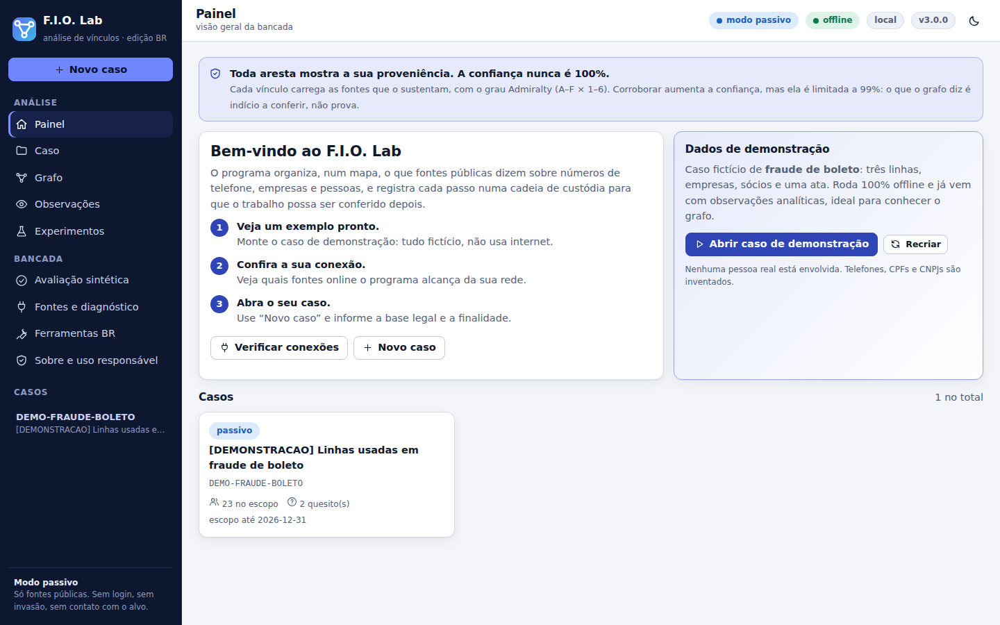
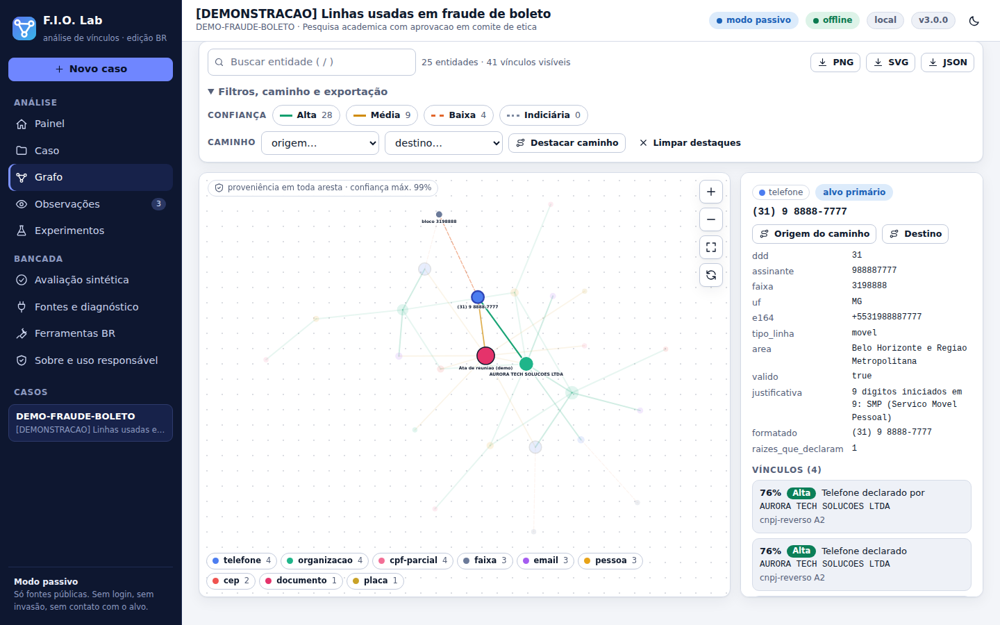
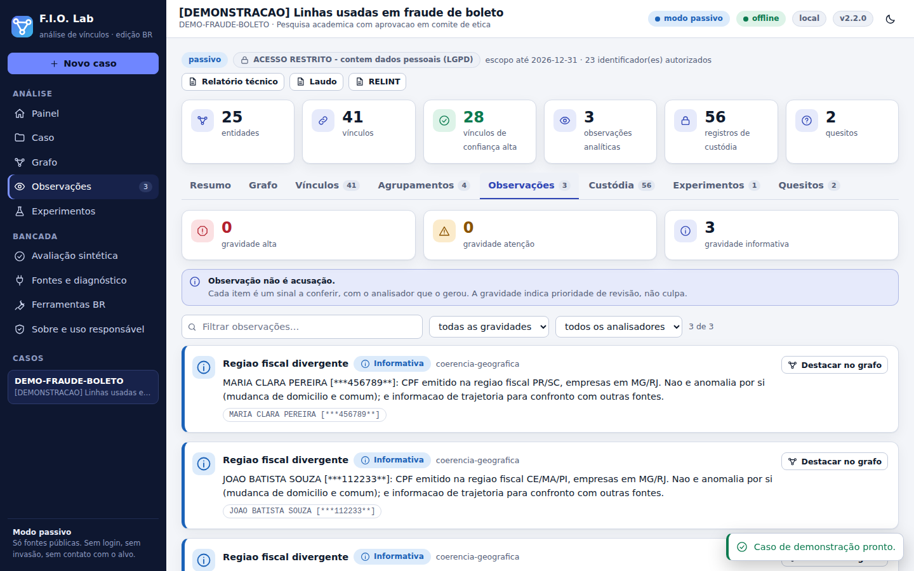
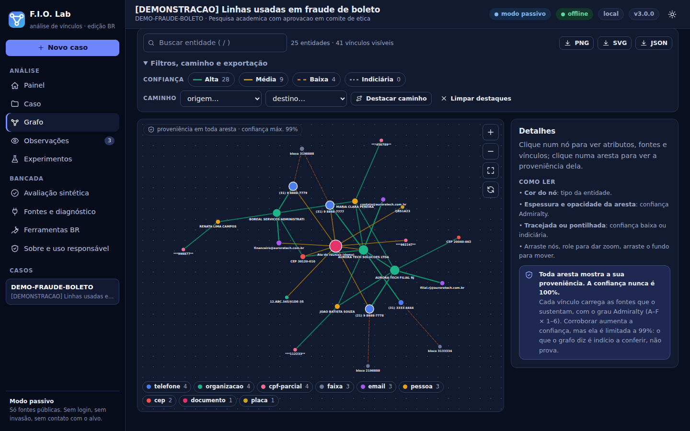

<p align="center">
  
</p>

<p align="center">
  <a href="https://github.com/Ridd1kulusC0d3r/FIO/actions/workflows/testes.yml"></a>
  <a href="https://colab.research.google.com/github/Ridd1kulusC0d3r/FIO/blob/main/colab/FIO_Lab_Colab.ipynb"></a>
  
  
  
  <a href="LICENSE"></a>
</p>

<p align="center"><a href="README.md">English</a> · <b>Português</b></p>

<p align="center"><strong>Fontes, Identificadores e Origens.</strong><br>
Estes números pertencem à mesma pessoa, à mesma empresa ou ao mesmo grupo? Com que confiança?<br>E com que frequência essa resposta erra?</p>

<p align="center">
  
</p>

---

## O que é

O F.I.O. Lab cruza **telefones, CNPJs, sócios, e-mails, domínios e diários oficiais** e monta um grafo de vínculos em que **toda aresta carrega a fonte que a sustenta**. Roda em Python puro (só biblioteca padrão, inclusive a bancada web), no seu computador ou no Colab.

Três regras não negociáveis:

| Regra | Como aparece no código |
|---|---|
| **Sem escopo, sem coleta.** | Todo caso exige base legal, finalidade e prazo. O escopo é conferido a cada pivô; fora dele, o coletor não roda. |
| **Sem fonte, sem vínculo.** | A aresta nasce com ao menos uma `Fonte`. A confiança segue a escala Admiralty, combina só fontes **independentes** e nunca chega a 100%. |
| **Sem prova, sem conclusão.** | Cada conclusão do relatório cita a aresta do grafo que a sustenta. Todo material coletado entra num ledger encadeado por SHA-256. |

## Três jeitos de usar

| Jeito | Para quem | Como |
|---|---|---|
| **Google Colab** | testar sem instalar | botão *Abrir no Colab* › *Ambiente de execução › Executar tudo* |
| **Dois cliques** | leigos, no próprio computador | baixe a [Release](https://github.com/Ridd1kulusC0d3r/FIO/releases), descompacte e abra o lançador do seu sistema ([COMECE-AQUI.md](COMECE-AQUI.md)) |
| **Linha de comando** | técnicos | `pip install git+https://github.com/Ridd1kulusC0d3r/FIO` e depois `fio --help` |

**Colab (3.2.0):** a sessão é deliberadamente efêmera: nada é montado no Google Drive. O caderno e a tela simplificada recebem telefone diretamente, constroem o índice por UF e oferecem modelo e relatórios para download antes de o runtime encerrar. A bancada completa continua disponível pelo mesmo servidor local.

```bash
fio demo --abrir        # caso fictício, 100% offline, abre a bancada
fio lab bancada         # a bancada web (http://127.0.0.1:8765)
```

## A bancada

<table>
  <tr>
    <td width="50%"></td>
    <td width="50%"></td>
  </tr>
  <tr>
    <td><sub><b>Painel.</b> Casos, caso de demonstração em um clique, verificação das fontes.</sub></td>
    <td><sub><b>Grafo.</b> Espessura e estilo da aresta seguem a confiança; clique mostra atributos, vínculos e fontes com hash.</sub></td>
  </tr>
  <tr>
    <td></td>
    <td></td>
  </tr>
  <tr>
    <td><sub><b>Observações.</b> Padrões que merecem conferência, com o analisador que os gerou. Não são acusações.</sub></td>
    <td><sub><b>Tema escuro</b> e layout responsivo (funciona no celular), sem fonte ou script externo.</sub></td>
  </tr>
</table>

O servidor escuta só em loopback, exige token por sessão (no fragmento da URL, que não vai para logs nem `Referer`), confere o cabeçalho `Host` contra DNS rebinding e não envia CORS. Detalhes em [docs/guia/bancada.md](docs/guia/bancada.md).

## Como funciona

```text
 alvos ─► preparação ─► coleta ───────────────► análise ─► relatório
          plugins        ingestão   nucleo       coerência    técnico (HTML/MD/CSV)
          hash do        normaliza  cnpj-reverso lote         laudo (art. 158-B)
          código         enriquece  querido-diário reuso       RELINT
                                    crt.sh · wayback · rdap   intermediários
                                    viacep · transparência    sanções
                          │                  │
                          ▼                  ▼
                 ledger SHA-256        grafo (Admiralty por fonte)
                 + artefatos           ─► claims ─► manifesto
```

Desenho completo em [ARQUITETURA.md](ARQUITETURA.md).

## Novidades da 3.0

| | O que faz | Por que importa |
|---|---|---|
| **Baseline diferencial** | Antes de aceitar uma resposta, consulta um valor que **não pode existir** e compara. Resposta quase igual é descartada. | Mata o falso achado clássico: a fonte devolve "200 OK" para qualquer coisa. |
| **Canários de contrato** | `fio/fontes.json` declara o que cada fonte deve devolver. `fio diagnostico` separa *fora do ar* de *mudou de formato*. | Avisa que um coletor quebrou antes de alguém ler um relatório vazio. |
| **Lote de registro** | Empresas de raízes distintas abertas na mesma janela de 30 dias e ligadas por telefone, e-mail, CEP ou sócio. | Redes de empresas de fachada abrem em lote. Escritório contábil também: o texto da observação diz como distinguir. |
| **Reuso de linha** | Telefone declarado por empresa encerrada e por outra ativa. | Evita tratar número reciclado como operador em comum. |
| **crt.sh e Wayback** | Subdomínios por Certificate Transparency e a primeira captura de um domínio. | Idade real e infraestrutura irmã, sem tocar o alvo. |
| **Boleto, PIX, CNH, CNS** | Linha digitável com DV mód. 10 e 11, banco, valor e vencimento; chave PIX aleatória; validação de CNH e CNS. | Extrai identificadores financeiros de texto livre sem confundir com CNPJ. |
| **Índice do CNPJ pronto** | `fio indice baixar --uf MG --pronto` baixa um índice enxuto e comprimido em **segundos** (SHA-256 conferido, retomável), em vez de montá-lo a partir de GBs da Receita. | O servidor da Receita costuma bloquear IPs de nuvem; o índice pronto fica no GitHub, que o Colab alcança. |
| **Pesquisa rápida e leve** | Fontes de rede em paralelo; `--rapido` e `--orcamento` limitam o trabalho; pontos quentes do ledger e do grafo corrigidos. | O pipeline offline foi de 40 s para 3,8 s num mundo sintético de 60 grupos. Veja [docs/guia/desempenho.md](docs/guia/desempenho.md). |
| **Claims rastreáveis** | `fio claims`: cada conclusão aponta a aresta que a sustenta. | Conclusão sem evidência no grafo não entra no relatório. |
| **Manifesto SHA-256** | `fio manifesto`: hash de cada peça amarrado ao ledger. | Detecta peça alterada, manifesto adulterado e ledger reescrito. |
| **Calibração** | `fio lab calibrar`: confiança declarada × precisão observada. | Mede se "0,76" significa 76%. |

Lista completa no [CHANGELOG](CHANGELOG.md).

## Quanto o F.I.O. acerta?

Mundos fictícios com gabarito e armadilhas reais de análise de vínculo (contabilidade, número reciclado, laranja, homônimo, **rede de fachada**…), sempre offline. Média ± desvio em 10 mundos × 15 grupos:

| Configuração | Precisão | Revocação | F1 |
|---|---|---|---|
| combinado, limiar 0,2, sem poda | 0,441 ± 0,154 | 0,885 ± 0,068 | 0,575 ± 0,141 |
| combinado, limiar 0,2, **com** poda de intermediários | 0,774 ± 0,184 | 0,714 ± 0,070 | 0,727 ± 0,115 |
| combinado, **limiar 0,4** | **0,878 ± 0,058** | 0,714 ± 0,070 | **0,785 ± 0,052** |
| sócio só por nome (ablação) | 0,389 ± 0,146 | 0,885 ± 0,068 | 0,527 ± 0,145 |

E a calibração, sem maquiagem: a confiança **ordena** certo, mas é **grosseira** (as arestas caem em três valores) e **conservadora** (a faixa 0,3–0,4 acerta 49%, e a 0,7–0,8 acerta 100% no sintético). O que vale são as comparações relativas; valide em casos reais rotulados antes de citar números absolutos. Método e leitura em [docs/guia/avaliacao.md](docs/guia/avaliacao.md).

## Uso em linha de comando

```bash
# caso com base legal, finalidade e escopo
fio caso novo --id CASO-2026-020 --titulo "..." --base-legal lgpd-7-vi \
  --finalidade "instruir notificação extrajudicial ..." --responsavel "Fulano" \
  --escopo "+5531988887777" "exemplo.com.br"

fio alvo --caso CASO-2026-020 --tipo telefone --valor "(31) 98888-7777"
fio lab pipeline --caso CASO-2026-020 --profundidade 2 --expandir-escopo \
  --relatorio tecnico.html --laudo laudo.html
fio claims --caso CASO-2026-020              # conclusões e suas evidências
fio relatorio --caso CASO-2026-020 --saida r.html --markdown r.md --manifesto
fio manifesto verificar --caso CASO-2026-020 # nada mudou desde a emissão?
fio doc extrair ata.txt                      # CPF, CNPJ, CEP, placa, boleto, chave PIX…
```

## Fontes

Cada coletor declara grau Admiralty e a **reserva** (o limite conhecido da fonte), que vai para o relatório.

| Coletor | Fonte | Modo | Grau |
|---|---|---|---|
| `nucleo` | plano de numeração (tabela local) | offline | A2 |
| `cnpj-reverso` | Dados Abertos do CNPJ (Receita), índice local | offline | A2 |
| `dados-abertos` | qualquer CSV/JSON/ZIP aberto indexado por *receita* | offline | por receita |
| `cnpj-api` | BrasilAPI (espelho da Receita) | rede | B2 |
| `querido-diario` | diários oficiais municipais | rede | A3 |
| `viacep`, `rdap`, `transparencia` | CEP/IBGE, registro.br, CEIS/CNEP | rede | B2 / A2 / A1 |
| `crtsh`, `wayback` | Certificate Transparency, Internet Archive | rede | B3 / B2 |
| `web`, `hibp` | índice público (com baseline), Have I Been Pwned | rede | C3 / B2 |

Tabela completa, receitas de dados abertos e o índice por UF: [docs/guia/fontes.md](docs/guia/fontes.md) · [docs/guia/indice-cnpj.md](docs/guia/indice-cnpj.md).

## Limites e uso responsável

O framework **recusa por construção**, sem flag para ligar: bases vazadas, credenciais de terceiros, interceptação, engenharia social e enumeração de plataformas de mensageria. CPF completo encontrado em documento entra no grafo **só mascarado** (LGPD, art. 6º, III). Vínculo é coocorrência documentada, não relação comprovada. Leia [USO-RESPONSAVEL.md](USO-RESPONSAVEL.md) e [SECURITY.md](SECURITY.md).

## Documentação

| | |
|---|---|
| [Manual ilustrado](https://Ridd1kulusC0d3r.github.io/FIO/) | passo a passo para quem está começando |
| [Guias por tema](docs/guia/) | [analisadores](docs/guia/analisadores.md) · [fontes](docs/guia/fontes.md) · [documentos](docs/guia/documentos.md) · [avaliação](docs/guia/avaliacao.md) · [laudo e plugins](docs/guia/laudo-e-plugins.md) · [bancada](docs/guia/bancada.md) |
| [ARQUITETURA.md](ARQUITETURA.md) | pacotes e decisões de projeto |
| [Arquitetura no Colab](docs/ARQUITETURA-COLAB.html) | como o caderno executa |
| [CHANGELOG.md](CHANGELOG.md) · [CONTRIBUTING.md](CONTRIBUTING.md) | histórico e como contribuir |

## Desenvolvimento

```bash
python -m unittest discover -s testes -v     # 139 testes; o E2E usa Playwright se instalado
python testes/fumaca.py                      # fumaça da CLI
python testes/ao_vivo.py                     # contrato das fontes reais (internet)
python tools/gerar_midia.py                  # regenera docs/img/demo.gif
```

## Citação e licença

MIT. Para citar, use o [CITATION.cff](CITATION.cff).
